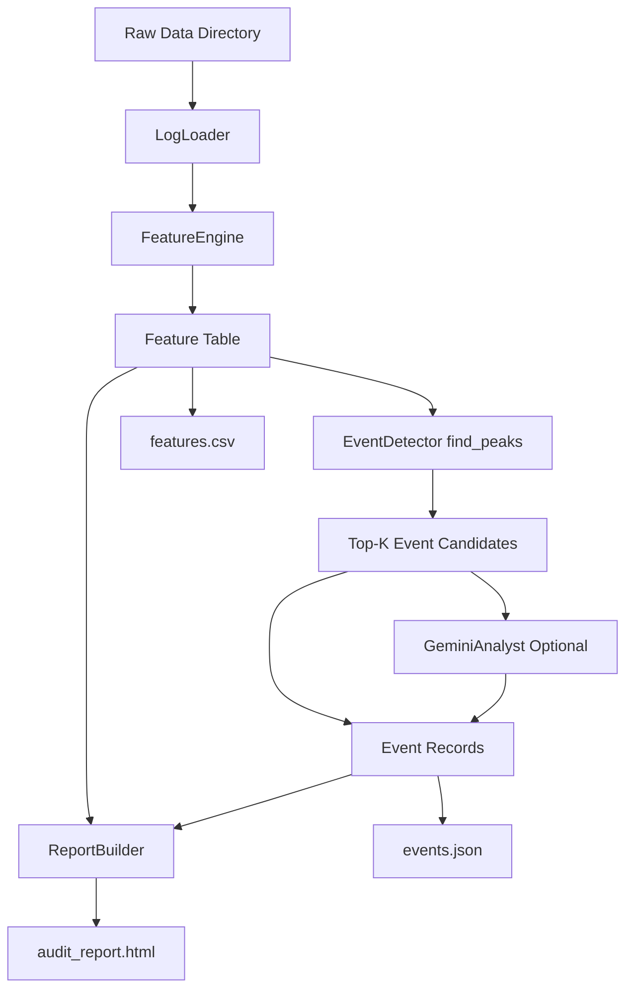

# Agri-Auditor Intelligence Roadmap

## CTO Deep Dive Edition

**Last updated:** February 21, 2026  
**Canonical source:** `high level discussion/intelligence_roadmap_1`  
**Repo mirror:** `docs/intelligence_roadmap.md`

---

## 1. Vision

### Product thesis
Agri-Auditor is a post-mission intelligence system for autonomous tractor logs. It converts high-volume multi-sensor telemetry into a compact, operator-ready incident narrative:

1. Detect high-severity moments with deterministic signal processing.
2. Add semantic context on those moments using a VLM (Gemini 3 Flash).
3. Deliver a portable, interactive mission report for engineering, operations, and leadership review.

### Why this matters
The product addresses the core operational bottleneck: teams cannot manually review full mission timelines at fleet scale. Agri-Auditor reduces the review surface from full-drive telemetry to ranked incident windows with supporting evidence.

### Deliverable contract
Primary artifact: `audit_report.html` (interactive dashboard) plus optional `features.csv` and `events.json`.

---

## 2. Scope and Current Status

### Program scope
The roadmap is organized into six phases:

1. Data Rig (ingestion and calibration handling)
2. Physics and Feature Engineering
3. Intelligence Layer (event scoring plus VLM captions)
4. Mission Control Dashboard
5. Productionization (CLI, Docker, CI, runtime config)
6. Documentation and final polish

### Status as of February 21, 2026

| Phase | Status | Date | Evidence |
|---|---|---|---|
| Phase 1: Data Rig | Completed | 2026-02-12 | `python -m pytest -q` => `7 passed` |
| Phase 2: Features | Completed | 2026-02-12 | `python -m pytest -q` => `13 passed`; `rows=1085` export |
| Phase 2.5: Agri-Physics Expansion | Completed | 2026-02-12 | `tests/test_features.py` => `13 passed` |
| Phase 3: Intelligence | Completed | 2026-02-12 | `python -m pytest -q` => `21 passed`, later `31 passed` after revisions |
| Phase 4: Dashboard v1/v2 | Completed | 2026-02-20 | v1 `66 passed, 3 skipped`; v2 `34 passed`; report produced |
| Phase 5: Productionization | Completed | 2026-02-21 | deterministic suite `82 passed, 3 deselected` |
| Phase 6: Documentation and polish | In progress | 2026-02-21 | This document refresh |

---

## 3. Data Reality and Constraints

The implementation is intentionally designed around observed dataset constraints:

1. Calibration dimensions may be zero in calibration JSON for `front_center_stereo_left`.
2. Depth is sparse (about 31 percent of frames).
3. `gps_speed` is missing; velocity is derived from pose deltas.
4. Depth is `uint16` in millimeters, and zero values are invalid and must be masked.

### Engineering implications

1. Camera model dimensions are inferred from real images when calibration width and height are zero.
2. Depth gaps are preserved as blind intervals (`NaN`) instead of interpolated values.
3. Feature extraction and scoring are NaN-safe by design.
4. Safety metrics are built from valid depth pixels only.

---

## 4. Architecture

### System architecture



### Module map

- `src/agri_auditor/ingestion.py`: manifest loading, velocity derivation, calibration resolution, image access
- `src/agri_auditor/features.py`: roughness, clearance, canopy proxy, orientation, sensor-health features
- `src/agri_auditor/intelligence.py`: scoring, event ranking, Gemini integration, serialization
- `src/agri_auditor/reporting.py`: interactive dashboard generation
- `src/agri_auditor/cli.py`: unified commands (`features`, `events`, `report`, `process`, `benchmark-gemini`)
- `.github/workflows/ci.yml`: deterministic lane plus optional `gemini_live` lane

---

## 5. Reliability and Security Posture

### Reliability controls implemented

1. Safe-value imputation in severity scoring:
- `roughness -> 0`
- `yaw_rate -> 0`
- `imu_correlation -> 1.0`
- `pose_confidence -> 100`

2. Final severity hardening:
- `replace([inf, -inf], nan).fillna(0.0)`

3. Depth safety behavior:
- missing depth remains blind (`NaN`), not interpolated

4. Gemini resilience:
- SDK primary path
- REST fallback path
- graceful degradation to `AI Analysis Unavailable`

5. Runtime safety:
- Docker runs as non-root user (`agri`)

### Security boundary

1. Gemini output is treated as explanatory metadata for audit context.
2. AI output is not used for real-time control decisions.
3. Known risk: visual hallucination remains possible; mitigated by limiting AI usage to post-mission narrative support.

### Risk register

| Risk | Impact | Current mitigation | Next hardening step |
|---|---|---|---|
| VLM hallucination | Misleading narrative labels | AI is advisory only; deterministic signals remain source of detection | Add explicit confidence and citation fields per caption |
| Calibration drift | Incorrect spatial interpretation | Dynamic dimension inference and calibration checks | Add periodic online calibration validation |
| Depth dropout | False confidence in clearance | Blind intervals represented as `NaN` | Add dropout-specific event type and dashboard warnings |

---

## 6. Performance and Scalability

### Event captioning model benchmark (executed)

**Benchmark setup:** 5 real event frames (`89, 272, 609, 797, 1034`), 2 repeats each model (20 total calls).  
**Archive:** `artifacts/gemini_benchmark_comparison.json`

| Metric | Gemini 3 Flash | Gemini 2.5 Flash |
|---|---:|---:|
| Success rate | 100% (10/10) | 100% (10/10) |
| Latency p50 | 3,507 ms | 4,835 ms |
| Latency avg | 3,654 ms | 5,058 ms |
| Latency p95 | 5,500 ms | 6,538 ms |
| Throughput | 16.4 calls/min | 11.9 calls/min |
| Thinking tokens total | 2,357 | 6,668 |
| Output tokens total | 304 | 230 |
| Total tokens total | 13,841 | 9,738 |

### Model decision
Gemini 3 Flash (`gemini-3-flash-preview`) is adopted for this workflow because it improves latency and throughput while maintaining strong qualitative relevance and specificity.

### Pipeline performance evidence

| Checkpoint | Date | Result |
|---|---|---|
| Feature export | 2026-02-12 | `rows=1085`, `roughness_non_null=1085`, `min_clearance_m_non_null=343` |
| Events export (offline) | 2026-02-12 | `rows_processed=1085`, `peaks_found=6`, `top_k_written=5` |
| Report generation (cockpit v1) | 2026-02-20 | `1232.3 KB` in `1.5s` |
| Report generation (cockpit v2) | 2026-02-20 | `3587.9 KB` in `~16s` |

### Scalability tradeoffs (current design)

| Decision | Benefit | Cost |
|---|---|---|
| `find_peaks` prefilter before VLM | Controls API volume and latency | May miss incidents not reflected in selected signals |
| Static HTML artifact | Easy sharing and review | Large file size with embedded media |
| Rich UI interactivity (Split.js, map sync, CSV export) | High triage usability | Larger frontend complexity |

---

## 7. MLOps and Operationalization

### Runtime and deployment

1. Dockerized runtime (`python:3.13-slim`) with non-root execution.
2. Unified package CLI (`python -m agri_auditor` and `agri-auditor`).
3. Config-driven runtime via `.env.example` and validated runtime config.
4. Structured logging support (`json`, `console`, `auto`).

### CI strategy

- Deterministic lane: `python -m pytest -q` (default excludes `gemini_live`)
- Live lane: `python -m pytest -q -m gemini_live -o addopts="-p no:cacheprovider"`
- Live lane is gated on `GEMINI_API_KEY`
- CI prepares synthetic `provided_data` via `scripts/prepare_test_data.py`

### Proven operational path

```bash
python -m agri_auditor process \
  --data-dir ../provided_data \
  --output-features artifacts/features.csv \
  --output-events artifacts/events.json \
  --output-report artifacts/audit_report.html \
  --disable-gemini
```

---

## 8. Delivery Timeline

### Completed delivery milestones

| Date | Milestone | Highlights |
|---|---|---|
| 2026-02-12 | Steps 1 to 3 completed | ingestion, features, initial intelligence pipeline with tests |
| 2026-02-12 | Phase 2.5 and Step 3 revision completed | orientation, health signals, NaN-safe multi-modal scoring, surround paths |
| 2026-02-20 | Step 4 completed (v1 then v2) | cockpit UI, Split.js layout, synchronized telemetry-map-feed interactions |
| 2026-02-21 | Step 5 completed | Docker, unified CLI, config/logging, CI gating, expanded tests |

### Remaining work (Phase 6)

1. Final documentation standardization and stakeholder packaging.
2. Architecture diagram and concise operations runbook for onboarding.
3. Optional: tighten reporting artifact strategy for larger missions.

---

## 9. CTO Discussion Guide

### Product narrative (technical)

"Agri-Auditor is a deterministic-plus-GenAI incident audit stack. We use signal processing to detect where to look, then use Gemini only on those windows to explain what happened. This keeps cost and latency bounded while preserving semantic depth for operators and executives."

### Design choices and rationale

1. Hybrid intelligence (signals for detection, VLM for explanation)
- Why: full-frame VLM scanning is too expensive for mission-length logs.

2. Blind depth handling
- Why: interpolating missing depth can create false safety confidence.

3. Static report artifact
- Why: zero-dependency sharing for field and leadership workflows.

### CTO-level questions to drive alignment

1. Edge versus cloud target for this workload in the next 12 months.
2. Whether incident frames are currently fed back into model training workflows.
3. Sensor roadmap expectations (stereo-only versus stereo plus LiDAR).
4. Preferred localization strategy in low-GPS reliability environments.
5. Obstacle reasoning preference (ROI depth heuristics versus occupancy-grid integration).

---

## 10. Acceptance Checklist

This rewrite satisfies the documentation acceptance criteria:

1. Major claims are traceable to `high level discussion/intelligence_roadmap_1` metrics and progress logs.
2. Timeline statements use explicit dates and are internally consistent as of February 21, 2026.
3. Document tone is executive-technical and removes iterative dev-note verbosity.
4. `high level discussion/intelligence_roadmap_1` and `docs/intelligence_roadmap.md` are aligned in content and recommendations.
